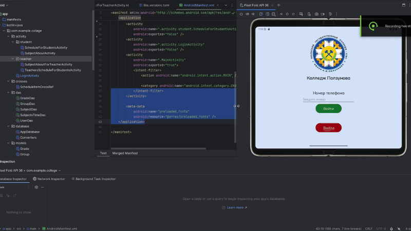

# 🏫 Collage app
## 📱 Mobile app on Kotlin
| 🐨 kotlin |🐘 gradle|☕ java|
|-----------|---------|--------|
|2.0.21     |8.11.1   |11      |

## 🧾 libs:
| ®️ room |🧑‍💻 ksp devtools|🙈 gson|
|-----------|---------|--------|
|2.7.1      |2.1.21-2.0.1   |2.13.0     |
### 1. [Room](https://developer.android.com/training/data-storage/room)
### 2. [Kotlin Symbol Processing API](https://kotlinlang.org/docs/ksp-overview.html)
### 3. [Gson GitHub](https://github.com/google/gson)

🪆 App fully in Russian language
---

## 🥸 Login
We have simple login via phone number and it search and compare it to get role
## 🧑‍🎓 Student 
When we enter in our account we can see schedule even other groups. In this app we can enter in subjects and look on marks and student's teacher who will teach a lesson. After all we can enter in teacher card
and see his/her schedule
> TODO - make schedule only for groups not for all
## 🧑‍🏫 Teacher
When we enter we can see our schedule. We have cards of Subjects. If we enter in this item we go to some subject and put some grades some students

## Result

